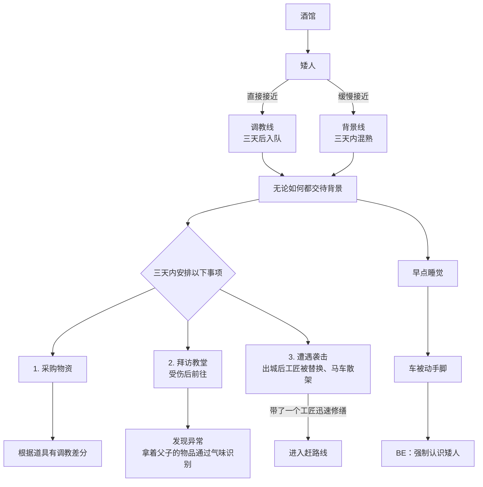

# 艾泽偶像线（大纲整理）

> 整理自群聊讨论记录（09-01），参与者：洛书（市场部）、AZ（研发部）、[[黑川江凌]] 等。

## 开头流程图：艾泽商人线 · 洛蒙特城

![[33bfd36a3703ec414d0e5d990ba03f0c.jpg]]

## 一、线路定位

- **归属线路**：深渊/城 线，即「深渊爱抖露线」。
- **核心概念**：「新式恶魔」/「无害恶魔」——不靠直接造成破坏，而是用另一种方式「摧毁」：看似无害，实则在慢慢瓦解人的价值观，在异世界开启打赏和周边经济。（「如果没有那只白毛红瞳老虎的直播的话……瓦塔西」）
- **重要决定：做经纪人，不做偶像本人**。理由：
  - 宗教类的线已经有了（神父线已有类似宗教主），偶像若做成宗教就重复了；
  - 偶像是虚幻的概念，是 50% 技艺表演 + 50% 想象，所以不能让 AZ 本人来；
  - 经纪人模式下可以有男团，不局限于 AZ 一个人——群友可以做偶像，异世界甚至可以有龙男偶像。
- **魅魔设定**：无性；让魅魔拟态成艾泽的样子出道。
- 氛围定位：听起来像是 4 月 1 号才开放游玩的线；彩蛋方向「把全大陆变成福瑞控」。

## 二、玩法循环

1. 征战冒险，收集各种材料，升级你的魅魔/偶像；
2. 插设服务器，在物质界做公关服务；
3. 开设梦网直播；
4. 吸收全世界人的精气和打赏。

## 三、动机与世界观

- 起因：「为了拯救濒临关停的……」——主播黑川重度依赖。
- 了解到这是神世界后，开始收集**信仰**。

![[01e937d853ce7bbb7216c6ab7f85f6d2.jpg]]

## 四、升级素材（DND 风味）

搜集下列素材升级魅魔/偶像：

- 「大师的初精」
- 背叛者制成的禁忌肉便器
- 纯洁独角兽木马
- 克拉肯飞机杯
- 奇美拉吸乳器
- 恶魔领主的乳汁
- 被掰弯豺狼领主的悔恨泪水和淫水
- 用金龙逆鳞制成的狗牌

**数值分工**：AZ 本人走战斗力升级路线；用战斗力搜集到的魅力值材料喂给偶像升级。

## 五、城市经营：精酿

- 城市特产为「精酿」——即精液酿，「品种」指的是人（如去音乐公司能抓捕到「瑞洛精酿」）。
- 城市有军队；敌对派来袭时自卫反击，挑几个战败者做成精酿。
- 连城主也不放过：等城主退休就邀请他进酒桶。
- 结论：洛蒙特很不安宁，但「解决完这码事就安宁了」。

## 六、待定事项

- [ ] 为什么要走这条路（动机还需进一步讨论）
- [ ] 偶像升级后的形态变化（用这些素材升级 AZ/偶像会变成什么样子）
- [ ] 城市还应生产哪些品种的精酿
